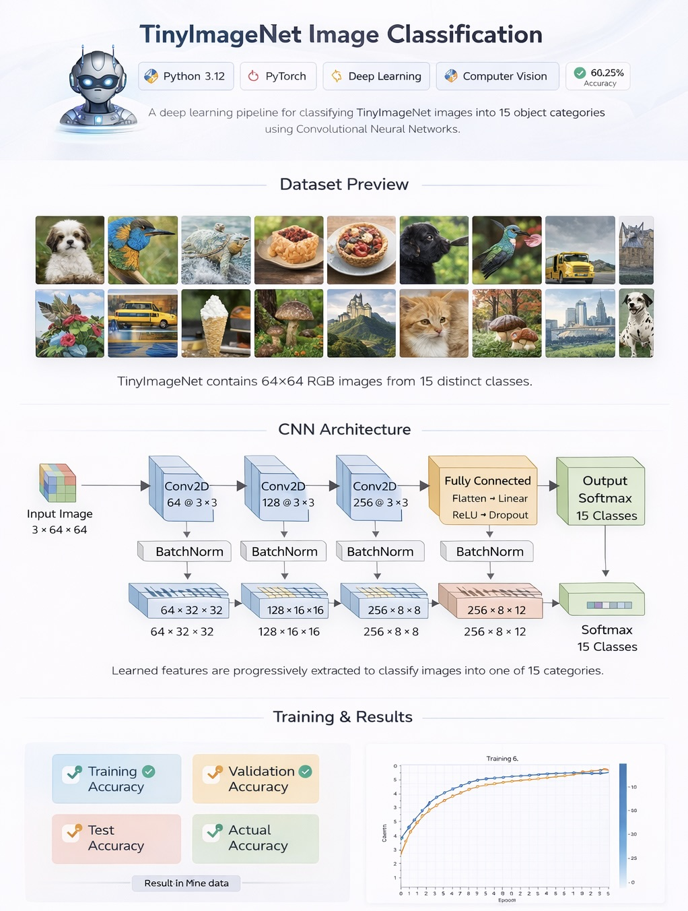
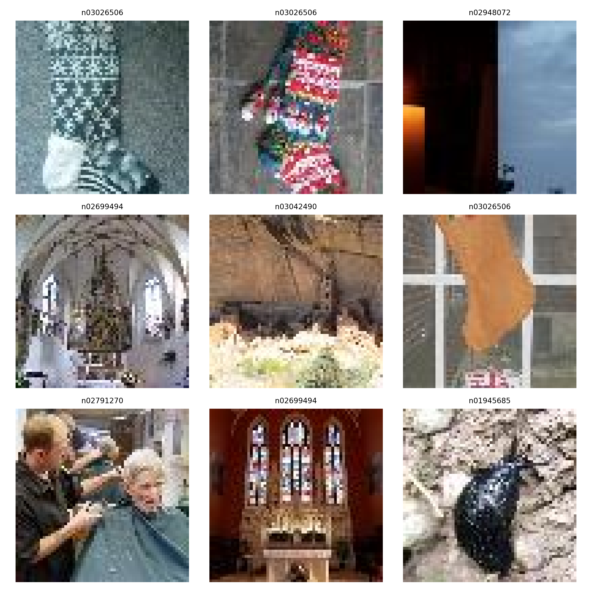
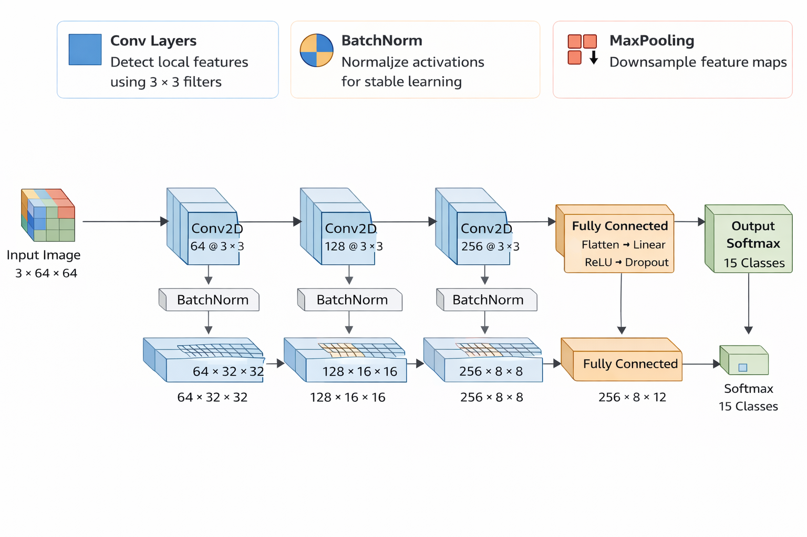
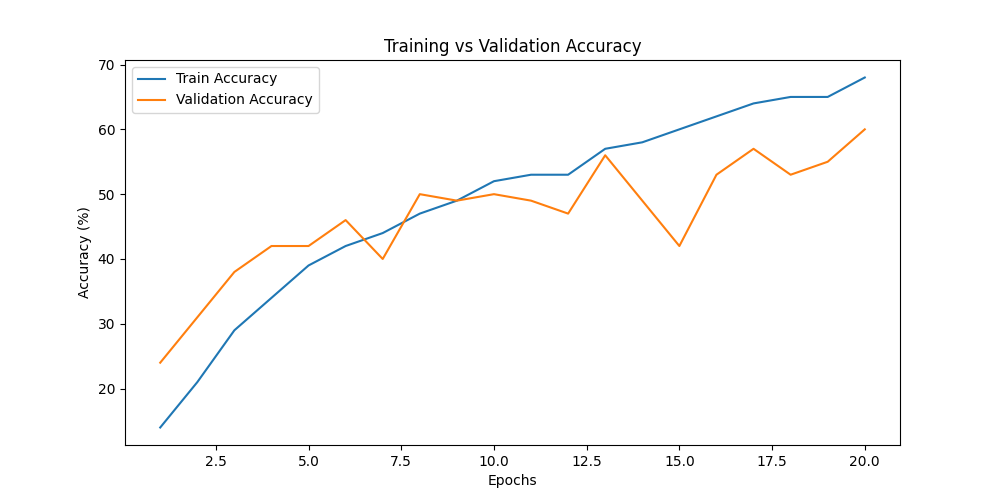
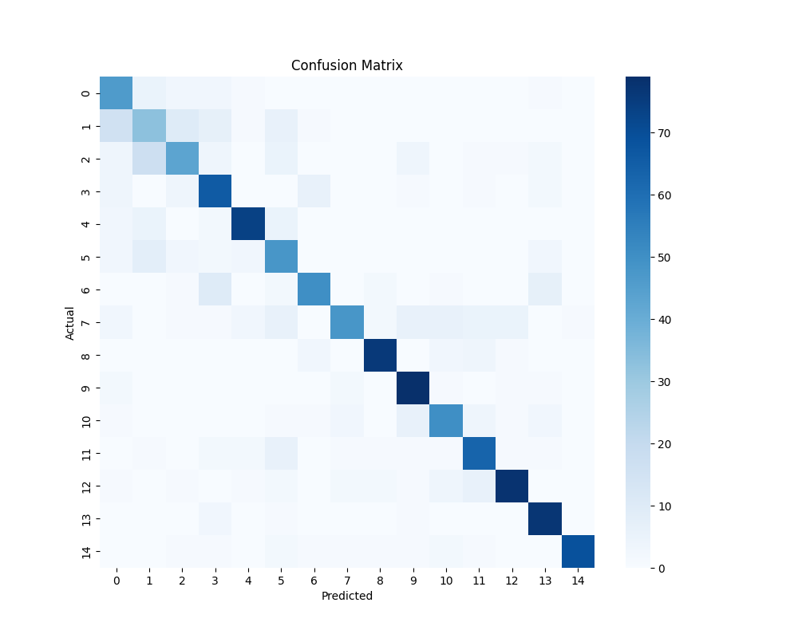

# 🧠 TinyImageNet CNN Image Classification

Deep Learning project implementing a **Convolutional Neural Network (CNN)** to classify images from the **TinyImageNet dataset** using **PyTorch**.

<p align="center">
  
</p>


---

# 📌 Project Overview

This project builds an **end-to-end computer vision pipeline** to classify images using a **Convolutional Neural Network (CNN)** trained on the TinyImageNet dataset.

The implementation demonstrates practical experience in:

- Deep Learning
- Computer Vision
- PyTorch model development
- Model evaluation and visualization
- Machine Learning experimentation

The workflow includes:

• Dataset preprocessing  
• CNN architecture design  
• Model training and evaluation  
• Visualization of results  
• Confusion matrix analysis  

---

# 🗂 Dataset

The model is trained on the **TinyImageNet dataset**, which is a smaller subset of ImageNet widely used for computer vision research.

Dataset characteristics:

• **200 object classes**  
• **500 training images per class**  
• **50 validation images per class**  
• **Image size: 64 × 64 pixels**  
• **Total images: 100,000+**

### Dataset Samples

<p align="center">
  
</p>

Dataset Source:

http://cs231n.stanford.edu/tiny-imagenet-200.zip

---

# 🏗 CNN Architecture

The CNN model is implemented using **PyTorch** and includes:

• Convolutional layers for feature extraction  
• ReLU activation functions  
• Max pooling layers  
• Fully connected layers  
• Softmax output layer for classification  

### Architecture Visualization

<p align="center">
  
</p>

---

# ⚙️ Training Pipeline

The training pipeline follows these steps:

1️⃣ Load TinyImageNet dataset  
2️⃣ Preprocess and normalize images  
3️⃣ Train CNN model using mini-batch gradient descent  
4️⃣ Evaluate model performance on validation data  
5️⃣ Track training loss and accuracy  

Training implementation:

```
src/train.py
```

---

# 📊 Results

### Training Accuracy

<p align="center">
  
</p>

### Confusion Matrix

<p align="center">
  
</p>

These results help evaluate the model's **classification performance and prediction patterns** across different classes.

---

# ⚡ Installation

Clone the repository:

```
git clone https://github.com/prernaalkute/tinyimagenet-computer-vision-classification.git
```

Navigate to the project directory:

```
cd tinyimagenet-computer-vision-classification
```

Install dependencies:

```
pip install -r requirements.txt
```

---

# ▶️ Running the Project

Train the CNN model:

```
python main.py
```

Visualize dataset samples:

```
python visualize_dataset.py
```

Plot training accuracy:

```
python plot_training.py
```

Generate confusion matrix:

```
python confusion_matrix.py
```

---

# 📁 Repository Structure

```
tinyimagenet-classification
│
├── assets/
│   ├── cnn_architecture.png
│   ├── confusion_matrix.png
│   ├── dataset_samples.png
│   ├── tinyimagenet_overview.png
│   └── training_accuracy.png
│
├── notebooks/
│   ├── Phase_1&2.ipynb
│   ├── Phase_3.ipynb
│   └── Phase_4.ipynb
│
├── src/
│   ├── dataset.py
│   ├── model.py
│   └── train.py
│
├── main.py
├── config.py
├── visualize_dataset.py
├── plot_training.py
├── confusion_matrix.py
└── requirements.txt
```

---

# 🚀 Future Improvements

Possible improvements for this project:

• Implement **ResNet / EfficientNet architectures**  
• Apply **data augmentation techniques**  
• Add **hyperparameter tuning**  
• Implement **model checkpointing**  
• Deploy model using **Flask / FastAPI**  
• Train on **larger image datasets**

---

# 👩‍💻 Author

**Prerna Alkute**  
MSc Artificial Intelligence

GitHub:  
https://github.com/prernaalkute

---

⭐ If you found this project useful, please consider **starring the repository**.
